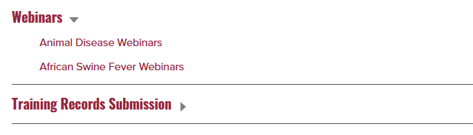

# Web Components Library (Drupal and Blazor)

Using native web components can be tricky sometimes, especially when used in conjunction with a CMS like Drupal. This web component library can be dropped into your drupal theme
and by adding a few lines of code to your project you can easily import your web components just by adding the name of your component to the components.json file.

## Features
    - Easily add your web components to your drupal site
    - Created a JavaScript array for accessing your html template files instead of appending them to the page.
    - Handles ensuring files are imported in the correct order to prevent issues with web component JS files being loaded before template is appeneded
    - Provides a standard way of accessing your template files from JS files

## Blazor Setup
    - Place components folder at top level of your wwwroot folder
    - replace import.js and components.json with the ones in the Blazor folder
    - Add import.js and jQuery to your App.razor file


## Setup:
    - Add following theme hook to MYTHEME.theme
```php
    function HOOK_preprocess_html(&$variables) {
      $variables['#attached']['drupalSettings']['path']['themeUrl'] = \Drupal::theme()->getActiveTheme()->getPath();
    } 
```
    - Place components folder at top level of your theme

    - Add theme name to the components.json file.
        *(theme name should match the folder containing your theme)

    - Add components/import.js to libraries.yml with
        jquery and drupalSettings as dependencies (see below)
```yml
component-library:
  version: VERSION
  js:
    components/import.js: {}
  dependencies:
    - core/jquery
    - core/drupalSettings
```


## Adding components Instructions:
    - Create a folder with the name of your web component

    - Add javascript file with the same name as folder

    - Add HTML template file with the same name as folder

    - Add Components to the components.json file under the "Components" section

    - Import script will automatically read in all of your
        javascript and HTML template files

    - Be sure to use the following code to get the component template
``` js
    // Where COMPONENT_NAME = the name of your web component
    importer.templates.find(c => c.component === 'COMPONENT_NAME');
```
    - Also be sure youre selecting the content and cloning the node as shown below
```js
    // Where this.shadow refrences your shadowRoot Instance
    this.shadow.append(this._template.template.content.cloneNode(true));
```

## Added JavaScript variables
    - baseURL | returns the path to the theme (themes/MYTHEME)
    - themeName | returns the name of the theme (MYTHEME)

## Notes
    - Drupal: When using web components in twig template, {{ title_prefix }} and {{ title_suffix }}
        are located outside of your web component tags in order to maintain
        ability to edit block content inside layout builder (See examples folder)


## Included Components
### Modal
    - Generic modal
        - Styling:
            - Banner color uses --primary-color-1
        - Slots:
            - title - displayed at top of modal
            - body - displayed in body of modal
        - Observed Attributes:
            - open - when true, modal is displayed

 
### ParagraphBlock
    - Simple block with a header and header banner, and a body of text below.
        - Styling:
            - Banner color uses --primary-color-1
        - Slots: (Works best when using spans in slots)
            - title - displayed at top of block
            - content - displays body of block
        - ObservedAttributes:


### FileDownload
    - Provides a box with a file icon and file name that users can click in order to download the file
        - Styling:
            - Banner color uses --primary-color-1
        - Slots: (Works best when using spans in slots)
            - file-name - displayed above file icon at the top of the box.
        - Observed Attributes:
            - link - this is where you will provide the link to the file


### PersonCard
    - Provides a card with an image, name, and 2 extra fields for additional information
        - Styling:
            - Image default resolution 310x434
        - Slots: (Works best when using spans in slots)
            - name - name of person
            - field-1 - first field of information
            - field-2 - second field of information
        - Observed Attributes:
            - link - link to headshot image
            - alt-text - alt text for headshot image
 

### SocialLinks
    - Provides a card with social media icons that link to the provided social media pages
        - Styling:
            - 
        - Slots: (Works best when using spans in slots)
            - 
        - Observed Attributes:
            - facebook-link: link to facebook page
            - twitter-link: link to twitter page
            - instagram-link: link to instagram page
            - pinterest-link: link to pinterest page
            - fill-color: color of the icons (default is white)


### ContactBlock
    - Provides a block with a company logo, company name, and 4 extra fields for additional address information and a block for email, phone, and fax.
        - Styling:
            - Icon default resolution 75x55
        - Slots: (Works best when using spans in slots)
            - name - name of person
            - address-field-1 - first field of information
            - address-field-2 - second field of information
            - address-field-3 - third field of information
            - address-field-4 - fourth field of information
        - Observed Attributes:
            - logo-link - link to company logo
            - email - email address
            - phone - phone number
            - fax - fax number


### Timeline
    - Provides a timeline with a list of events
        - Styling:
            - 
        - Slots: (Works best when using spans in slots)
            - [Component]TimelineEvent - see component
        - Observed Attributes:
            -
### TimelineEvent
    - Provides a single event for the timeline component
        - Styling:
            -  
        - Slots: (Works best when using spans in slots)
            - content - text content of event
        - Observed Attributes:
            - year - year of event
            - image - path to image for event
            - image-alt - alt text for image


### ExpandableLink
    - Provides a link that expands to show more links when clicked
        - Styling:
            - See obsereved attributes for styling options
        - Slots:
            - links - list of links to display (use a list <ul> for best results)
        - Observed Attributes:
            - Color - color of the link (default is black)
            - link - adds link to the main anchor tag
            - text - adds text for the main anchor tag
            - font-size - sets font size of main anchor tag


### ModalView
    - Provides a modal that displays a view
        - Styling:
            - 
        - Slots:
            - Banner - Text to display at the top of the modal
            - content - content to display in the modal
        - Observed Attributes:
            - text - Text to display in the link that will open the modal
            - button (true or false) - if true, a button will be displayed instead of a link

